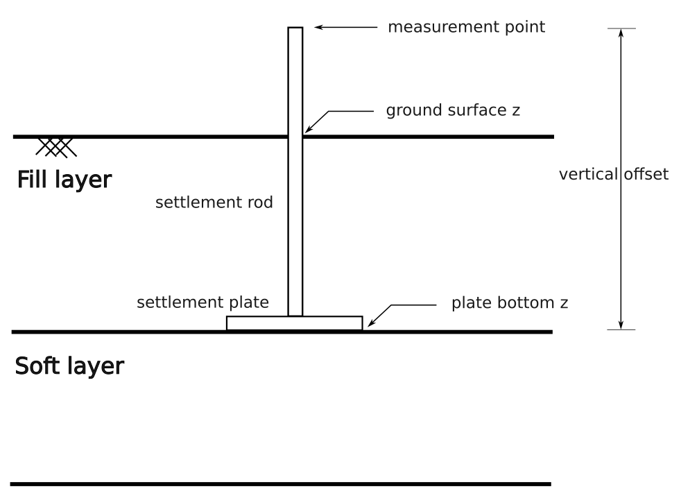

.. _reference:

Reference
=========

.. _settlementRodMeasurement:

Settlement Rod Measurement
----------------------------

A settlement rod device consists of a rod and a (bottom) settlement plate (see figure below). The measurements are taken at the top of the rod (i.e. `rod_top`) 
and at the `ground surface` and since the `rod length` is known, the settlement of at the bottom of the rod (i.e. `rod_bottom`) can be also derived.

The class `SettlementRodMeasurement` presented below stores the data of a single settlement rod measurement.

.. autoclass:: baec.measurements.settlement_rod_measurement.SettlementRodMeasurement
    :members:
    :inherited-members:
    :member-order: bysource

    .. automethod:: __init__
    
.. autoenum:: baec.measurements.settlement_rod_measurement.SettlementRodMeasurementStatus
    :members:

.. _settlementRodMeasurementSeries:

Settlement Rod Measurement Series
---------------------------------

.. autoclass:: baec.measurements.settlement_rod_measurement_series.SettlementRodMeasurementSeries
    :members:
    :inherited-members:
    :member-order: bysource

    .. automethod:: __init__

.. _measurementDevice:

Measurement Device
------------------

.. autoclass:: baec.measurements.measurement_device.MeasurementDevice
    :members:
    :inherited-members:
    :member-order: bysource

    .. automethod:: __init__

.. _project:

Project
-------

.. autoclass:: baec.project.Project
    :members:
    :inherited-members:
    :member-order: bysource

    .. automethod:: __init__

CoordinateReferenceSystems
--------------------------

.. _coordinateReferenceSystems:

.. autoclass:: baec.coordinates.CoordinateReferenceSystems
    :members:
    :inherited-members:
    :member-order: bysource

    .. automethod:: __init__

.. _IO:

Input/output
--------------

ZBASE
......

.. autofunction:: baec.measurements.io.zbase.measurements_from_zbase
