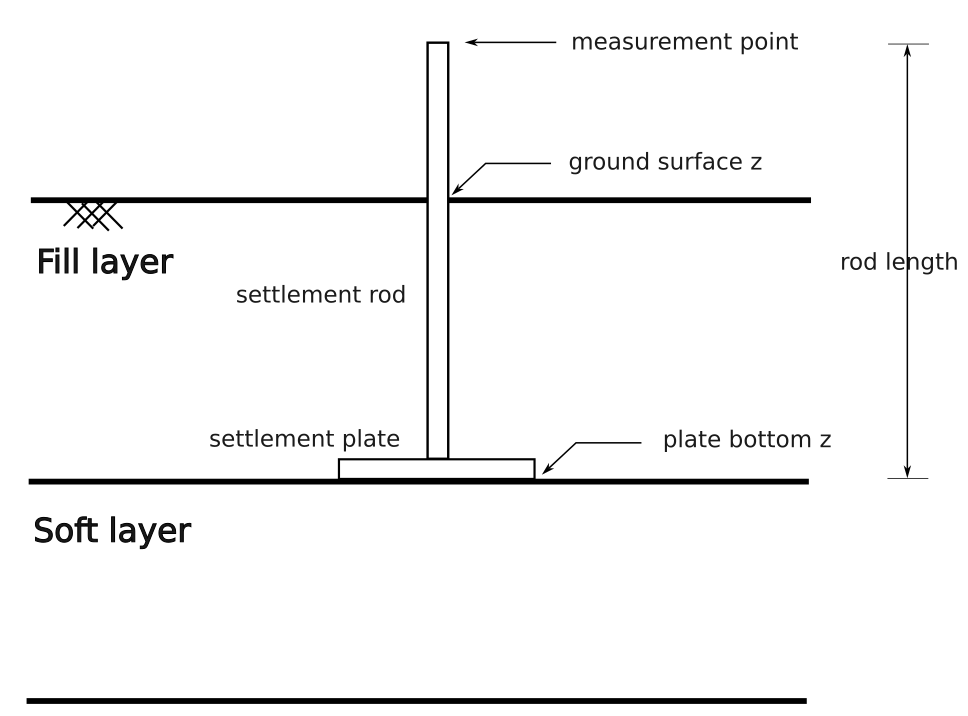

.. _reference:

Reference
=========

.. _settlementRodMeasurement:
Settlement Rod Measurement
----------------------------

A settlement rod device consists of a rod and a (bottom) settlement plate (see figure below). The measurements are taken at the top of the rod (i.e. the `measurement point`) 
and since the `vertical offset` between the measurement point is known, the settlement of at the bottom of the plate `plate bottom z` can be also derived. Optionally, 
the `ground surface z` can be measured by performing for instance radar measurements. 

The class `SettlementRodMeasurement` presented below stores the data of a single settlement rod measurement.

.. autoclass:: baec.measurements.settlement_rod_measurements.SettlementRodMeasurement
    :members:
    :inherited-members:
    :member-order: bysource

    .. automethod:: __init__
    
